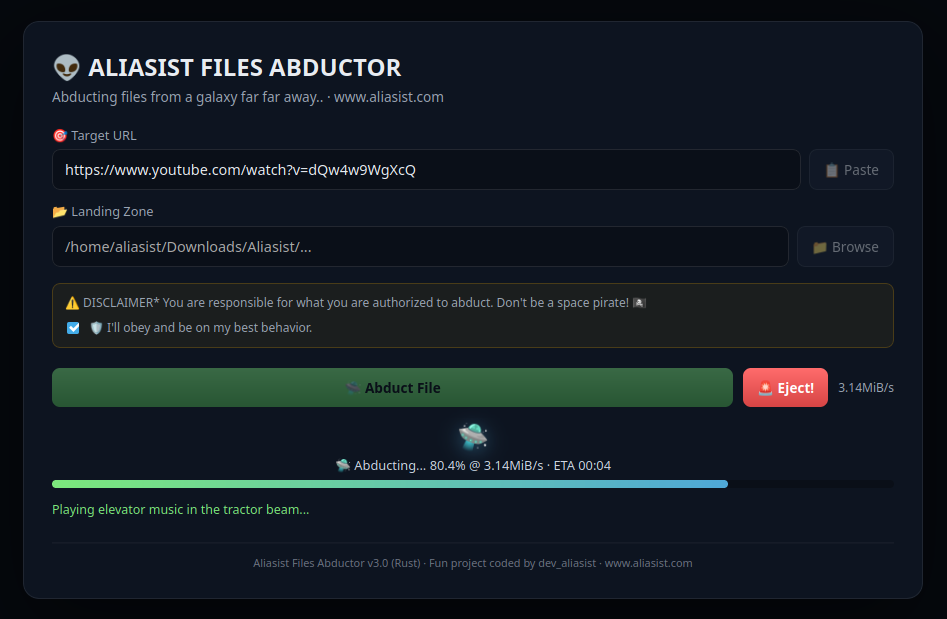
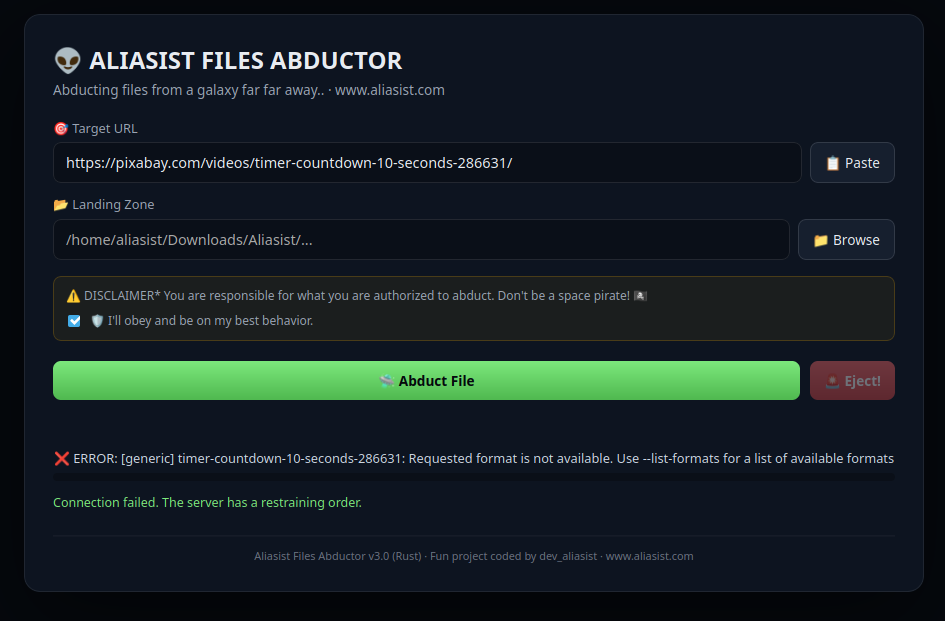
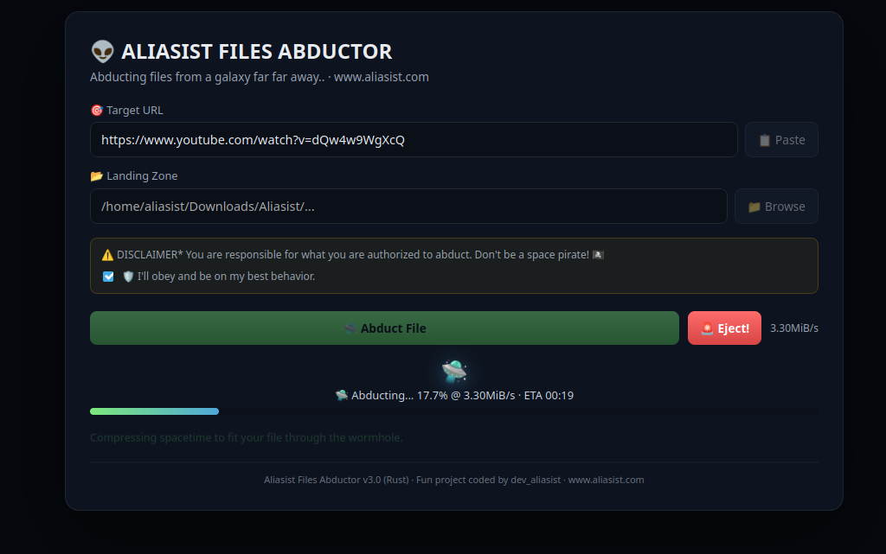

# 🛸 ALIASIST FILES ABDUCTOR SUITE

<div align="center">


### *Abducting files from a galaxy far, far away...*

[](https://github.com/aliasist/aliasist-files-abductor/releases)
[](https://www.rust-lang.org/)
[](https://tauri.app/)
[](https://www.electronjs.org/)
[](LICENSE)

</div>

---

## 🌌 Overview

**Aliasist Files Abductor** is a high-speed, universal media extraction and abduction application designed to download videos, audio tracks, streams, and files from across the internet (YouTube, Vimeo, TikTok, Pixabay, direct URLs, and 1000+ supported sites).

This repository is organized as a **dual-architecture suite**, offering both the next-generation high-performance **Rust + Tauri** rewrite and the original classic **Electron** application.

```
aliasist-files-abductor/
├── 🛸 abductor-tauri/       # Modern Rust + Tauri v2 rewrite (v3.0.0) [RECOMMENDED]
├── 👽 abductor-electron/    # Original Electron + JavaScript/Python app (v2.7.0)
└── 📖 README.md             # Master documentation & user guide
```

---

## 📸 Visual Showcase & Screenshots

### 🌌 1. Retro UFO Splash Sequence
> *An animated retro space scene with glowing tractor beams and real-time status calibration.*

<p align="center">
  
</p>

### 🛸 2. Modern Rust + Tauri Version (`abductor-tauri`)
> *Ultra-lightweight (~15 MB), instant startup, zero background bloat, bundled sidecar binaries, and glowing cyber Alien theme.*

<p align="center">
  
</p>

### 👽 3. Classic OG Electron Version (`abductor-electron`)
> *The original release featuring the retro animated UFO tractor-beam splash sequence, alien sound cues, and classic abduction joke bank.*

<p align="center">
  
</p>

---

## ⚡ Feature Comparison

| Feature | 🛸 `abductor-tauri` (v3.0.0) | 👽 `abductor-electron` (v2.7.0) |
| :--- | :---: | :---: |
| **Core Runtime** | **Rust + Tauri v2** | Node.js + Electron |
| **Installer Size** | **~15 MB** | ~90 MB |
| **RAM Consumption** | **~35 MB** | ~180 MB |
| **Startup Time** | **< 200 ms** | ~1.5s |
| **Standalone Sidecars** | ✅ Bundled (`yt-dlp` + `ffmpeg`) | Requires host/local dependencies |
| **Cloudflare Bypass** | ✅ Built-in Chrome Impersonation | ✅ Patched Impersonation args |
| **Silent Media Handling** | ✅ Full resilient fallback | ✅ Full resilient fallback |
| **UI Protection** | ✅ Text selection disabled | ✅ Text selection disabled |
| **Cross-Platform** | ✅ Linux (`.deb`/`.rpm`), Windows (`.exe`), macOS (`.dmg`) | ✅ Linux, Windows, macOS |

---

## 🚀 Getting Started

### 🛸 Option 1: Running `abductor-tauri` (Rust + Tauri) — *Recommended*

#### 1. Prerequisites
- **Node.js** (v18+)
- **Rust toolchain** (`cargo` and `rustc`):
  ```bash
  curl --proto '=https' --tlsv1.2 -sSf https://sh.rustup.rs | sh
  ```
- **Linux System Libraries** (Debian/Ubuntu):
  ```bash
  sudo apt update && sudo apt install -y libwebkit2gtk-4.1-dev build-essential curl wget file libssl-dev libayatana-appindicator3-dev librsvg2-dev
  ```

#### 2. Development Mode
```bash
cd abductor-tauri
npm install
npm run tauri dev
```

#### 3. Compiling Standalone Production Bundles
To package the app with bundled `yt-dlp` and `ffmpeg` sidecars for your platform:

```bash
cd abductor-tauri

# 1. Fetch platform static binaries
chmod +x scripts/fetch-binaries.sh
./scripts/fetch-binaries.sh

# 2. Build release package (.deb, .rpm, .AppImage / .exe / .dmg)
npm run tauri build
```
The output installers will be placed in `src-tauri/target/release/bundle/`.

---

### 👽 Option 2: Running `abductor-electron` (Original Electron)

#### 1. Prerequisites
- **Node.js** (v18+)
- **npm**

#### 2. Launching the App
```bash
cd abductor-electron
npm install
npm run dev
# (or npm start)
```

---

## 🧠 Under the Hood

### 🛡️ Cloudflare Anti-Bot Bypass & Impersonation
Modern video hosting platforms and media services frequently employ Cloudflare anti-bot challenges that reject standard automated scripts with HTTP 403 Forbidden errors. 

**Aliasist Files Abductor** addresses this by executing `yt-dlp` with browser impersonation:
```bash
yt-dlp --impersonate chrome --extractor-args "generic:impersonate" <URL>
```
This enables TLS JA3/JA4 fingerprint spoofing to securely abduct streams without triggering bot challenges.

### 🎥 Resilient Format Selection
To prevent crashes when abducting silent video clips (such as Pixabay stock footage without an audio stream), both engines utilize a multi-stage format selector:
```text
bestvideo*[vcodec^=avc1]+bestaudio[acodec^=mp4a]/bestvideo*[vcodec^=avc1]+bestaudio[ext=m4a]/bestvideo*+bestaudio/bestvideo*/best
```
This guarantees flawless extraction whether the source is a 4K multi-track container, a silent clip, or a raw single stream.

---

## 📦 Downloads & Releases

Pre-compiled binary releases for all major platforms can be downloaded directly from the GitHub Releases page:

- **Linux**: `.deb` (Debian/Ubuntu), `.rpm` (Fedora/RHEL), `.AppImage`
- **Windows**: `.exe` (Setup Installer / Standalone), `.msi`
- **macOS**: `.dmg` (Apple Silicon & Intel)

👉 **[Download Latest Release](https://github.com/aliasist/aliasist-files-abductor/releases)**

---

## 👽 Author & Community

- **Creator:** `dev_aliasist`
- **Website:** [www.aliasist.com](https://www.aliasist.com)
- **Repository:** [github.com/aliasist/aliasist-files-abductor](https://github.com/aliasist/aliasist-files-abductor)

---

## 📄 License

This project is licensed under the **MIT License** — see the [LICENSE](LICENSE) file for details.

*Disclaimer: You are solely responsible for verifying permissions and rights for any media abducted. Don't be a space pirate!* 🛸
